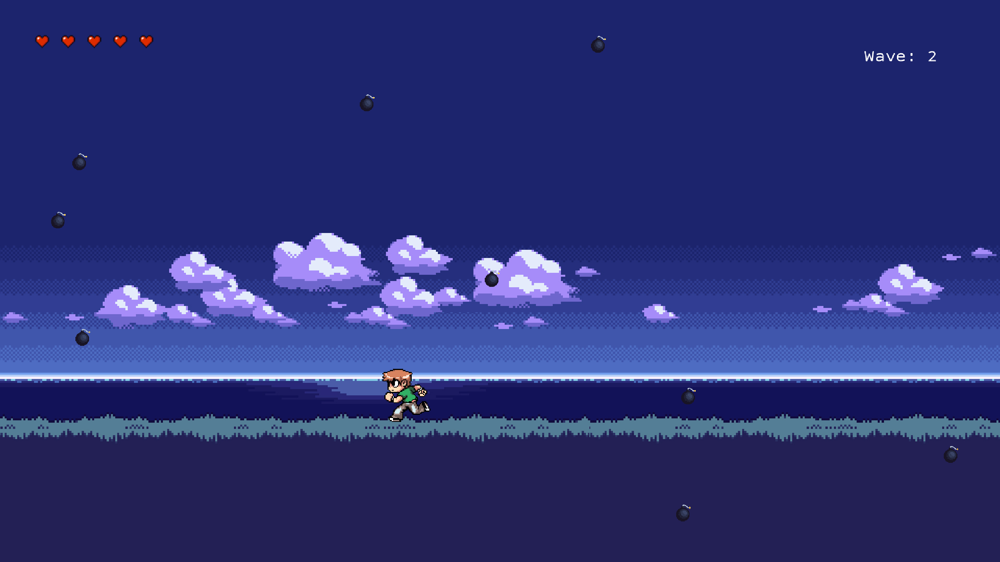
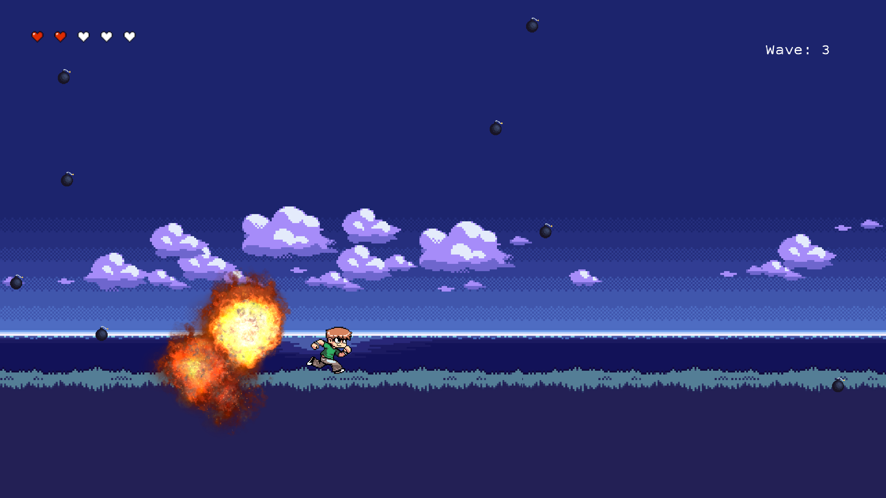

# A simple libGDX game

The game consists of simple main-menu, game and game-over screens.
The player must dodge falling bombs which begin to fall faster and more often.
This project was made using assets I was able to find and download off the internet,
including sprite sheets to animate player running and bomb explosions, and bomb
sound effects.





## How to play

The easiest way to run the program is via the
[JAR](./BombDodger.jar), which you can run with:
```
java -jar BombDodger.jar
```
or on Mac:
```
java -jar -XstartOnFirstThread BombDodger.jar
```


Alternatively, you can clone this repo and open it in Intellij.
Gradle will automatically prepare dependencies, and you can then compile and run the
program through the main method in `desktop/src/com/bomb_dodge/DesktopLauncher.java`. If
you're on a Mac you will need to modify the run configuration to include the flag
`-XstartOnFirstThread` under VM options.